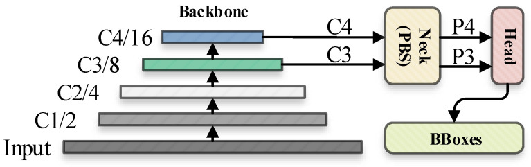
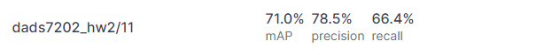

# 
 One Piece Character Detection 

by Capybarista Team

     

# Definition
- **Model 1** : Roboflow (Default) - (0.7) 
  Yolov5l on app.roboflow.com
- **Model 2** : Yolov5l - Weight False Freeze False 
  Yolov5l unfreeze all layers and don't use pretrain weights.
- **Model 3** : Yolov5l - Weight True Freeze False 
  Yolov5l unfreeze all layers and  use pretrain weights.
- **Model 4** : Yolov5l - Weight False Freeze True 
  Yolov5l freeze all layers and don't use pretrain weights.
- **Model 5** : Yolov5l - Weight True Freeze True 
  Yolov5l freeze all layers and  use pretrain weights.
- **Model 6** : Yolov5l - Weight True Freeze 10 
  Yolov5l freeze 10 layers (backbone) and use pretrain weights.

# Brief Result:

- Model comparison with mAP@0.5 score and Running time
   - Model 1 (Default) - (0.7 / not available)
   - Model 2 (0.709 / 5.36 hr)
   - Model 3 (0.787 / 5.35 hr)
   - Model 4 (0.002 / 2.42 hr)
   - Model 5 (0.066 / 2.43 hr)
   - Model 6 (0.673 / 3.22 hr)

- The Best Model (Highest score) = Model 3 (Unfreeze all layer and use pretrain weights)
- Alternative model (Balance between score and running time) = Model 6
  
# Introduction:
- Object detection: Object detection is a computer vision technique that allows us to identify and locate objects in an image or video. 
With this kind of identification and localization, object detection can be used to count objects in a scene and determine and track their precise locations, 
all while accurately labeling them. The comparison between image classification, object detection, and instance segmentation is shown below.

     

 

## YOLOv5
  
- YOLOv5: YOLO an acronym for 'You only look once, is an object detection algorithm that divides images into a grid system. Each cell in the grid is responsible for detecting objects within itself. YOLO is one of the most famous object detection algorithms due to its speed and accuracy.
[[Li, Karpathy,Johnson]](http://cs231n.stanford.edu/2016/)
- YOLOv5 continues the consistent idea of the YOLO series in algorithm design: the image to be detected was processed through a input layer (input) and sent to the backbone for feature extraction that has convolution layers. Then generated feature maps to detect the objects in the picture. After that will be sent to prediction head (head), And the confidence of bounding-box were executed for each pixel in the feature map to obtain a multi-dimensional array (BBoxes) including object class, class confidence, box coordinates, width, and height information. To filter the useless information in the array, and performing a non-maximum suppression (NMS) process (that has the purpose to select the best bounding box for an object and reject or “suppress” all other bounding boxes), the final detection information can be output. The process of converting the input picture into BBoxes is called the inference process [[Haiying Liu Fengqian Sun,Jason Gu,Lixia Deng]](https://www.ncbi.nlm.nih.gov/pmc/articles/PMC9371183/)

  
Inference process of YOLOv5

## Roboflow
- roboflow: Roboflow is a computer vision platform that allows users to build computer vision models faster and more accurately through the provision of better data collection, preprocessing, 
and model training techniques. Roboflow allows users to upload custom datasets, draw annotations, modify image orientations, resize images, modify image contrast and perform data augmentation. 
It can also be used to train models. 
*Link for more detail*: https://docs.ultralytics.com/ , https://github.com/ultralytics/yolov5 , https://pypi.org/project/yolov5/

     

## Image augmentation
- Image augmentation is an efficacious technique when we don’t have an ample amount of data for training a deep learning model. 
Our team do Image augmentation with roboflow (due to time limitation, we set criteria of image augmentation as default of roboflow). Following figure is image augmentation options in roboflow.

     

## mAP
- The mean Average Precision or mAP score is calculated by taking the mean AP over all classes and/or overall IoU thresholds, depending on different detection challenges that exist.[[Shivy Yohanandan]](https://towardsdatascience.com/map-mean-average-precision-might-confuse-you-5956f1bfa9e2)

## IoU
- Intersection over Union is the defacto evaluation metric used in object
detection. It is used to determine true positives and false positives in a set of predictions. When using IoU as an evaluation metric an accuracy threshold must be chosen [[Rezatofighi,Tsoi,Gwa,etc.]](https://openaccess.thecvf.com/content_CVPR_2019/papers/Rezatofighi_Generalized_Intersection_Over_Union_A_Metric_and_a_Loss_for_CVPR_2019_paper.pdf)

     

Step of roboflow for One Piece Character Detection Project
1. Upload photo to roboflow
2. Label One Piece Character in all photos.
3. Image preprocessing & Image augmentation
4. Train.
5. Deploy.

     

Image source and detail of roboflow tutorial --> https://blog.streamlit.io/how-to-use-roboflow-and-streamlit-to-visualize-object-detection-output/

# Our project in roboflow:
- Project Link: https://app.roboflow.com/dl-yjboe/dads7202_hw2
- Total image = 1182 pictures (Number of photos for each character shown below. Some pictures have multi-character)
- Number of photos after image augmentation = 11232
- Train-Test Split are 70 : 20 : 10 
  - After Image augmentation Train : Validation : Test are 87 : 8 : 5
- Other settings are shown below

     

     

# roboflow's outcome:
- mAP@0.5 for Train / Validation /Test of all character  = 71% / 68% / 70%

     

However, roboflow have tuning limitation. Next step, team will use jupyter in colab to adjust hyperparameter.

---------------------------------------------------
# Our project in jupyter-colab:
- Project Link: 
   - https://colab.research.google.com/drive/1hfHihyPVFt18axpft3brB-uG-jAQ9OoM?usp=sharing#scrollTo=ii8qC1HDUzZ6

- Six models were Comparison base on batch-size 16, 100 epochs and default hypermarameter

# mAP@0.5 score from Jupyter-colab:
-    **Model 1** mAP@0.5  0.71

      

   - **Model 2** mAP@0.5  0.709

     

   - **Model 3** mAP@0.5  0.787

     

   - **Model 4** mAP@0.5 0.002

     

   - **Model 5** mAP@0.5  0.066

     

   - **Model 6** mAP@0.5  0.673 

     

# Jupyter-colab's outcome:
- The best score model = Model 3, 0.787
- However, running time is high. The running time of each model is shown below

     

- Alternative model (Balance between score and running time) = Model 6 
   - Score drop = ~15%
   - Save time = ~40%
- Observation: 
   - Score: unfreeze layer model  > freeze layer model
   - Score: allow to update weight model  > No update weight model
   - Running time: unfreeze layer model  > freeze layer model
   - Running time: allow to update weight model  ~ No update weight model

# Summary
- Of the 7 models, That was found  the best mAP@0.5 model was Model 3 with the unfreeze model and pretrained weight, which has better results than the Model 2 that unfreeze nodel and don't use pretrained weight.
Both of these models give very different mA@0.5 values. While the time spent on the train was not significantly different. However, when looking at Model 6 and Model 3,  the mAP@0.5 of Model 6 was not significantly different from that of Model 2, but it took much less time to train than Model 2. The 4th and 5th models that freeze both models except the Inference Layer will give inappropriate results. This is because the Head section is related to predicting outcomes. which is not part of fature extraction.

# Next step:
- Add number of photos
- Use more features of image augmentation (Cutout, Grayscale, ...)
- Create standard of Labelling 
- Comparison to other versions of YoloV5 (YoloV5m,  YoloV5x, ...)
- Adjust hyperarameter
- 
# Reference:
- Object detection:
  - https://medium.com/zylapp/review-of-deep-learning-algorithms-for-object-detection-c1f3d437b852
  - https://machinelearningmastery.com/object-recognition-with-deep-learning/
  - https://medium.com/ml-research-lab/what-is-object-detection-51f9d872ece7
- Yolov5: 
  - https://docs.ultralytics.com/
  - https://github.com/ultralytics/yolov5
  - https://pypi.org/project/yolov5/
- roboflow:
  - https://roboflow.com/
  - https://blog.streamlit.io/how-to-use-roboflow-and-streamlit-to-visualize-object-detection-output/
- mAP defination
  - https://towardsdatascience.com/map-mean-average-precision-might-confuse-you-5956f1bfa9e2
  - https://openaccess.thecvf.com/content_CVPR_2019/papers/Rezatofighi_Generalized_Intersection_Over_Union_A_Metric_and_a_Loss_for_CVPR_2019_paper.pdf

---------------------------------------------------

# Capybarista Team member:
- Theeranat Sringamdee 641042014 
- พัชรพฤกษ์ วัฒนางกูร
- Nattapong Thanngam_6310422089 
- สุกิจ วาณิชฤดี_6310422092 
- อร มินเทียร์

- 6410414001 
- 6410412007 

     
